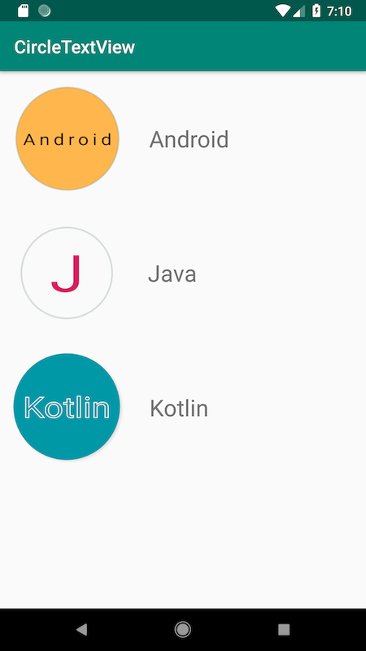

[](https://jitpack.io/#my-jabin/CircleTextView)

## CircleTextView

A easy-to-use CircleTextView, but it's **NOT** a `TextView`. It derived from `View` so it has no fancy properties like `drawableLeft` in the `TextView` or other properties.  

## Screenshot


## Download

### Gradle
Step 1. Add it in your root build.gradle at the end of repositories:

``` gradle
 allprojects {
		repositories {
			...
			maven { url 'https://jitpack.io' }
		}
	}
```
Step 2. Add the dependency

```
  dependencies {
	   implementation 'com.github.my-jabin:CircleTextView:Tag'
	}
```

### Maven
Step1. Add the JitPack repository to your build file
```
  <repositories>
		<repository>
		    <id>jitpack.io</id>
		    <url>https://jitpack.io</url>
		</repository>
	</repositories>
```
Step 2. Add the dependency
```
  <dependency>
	    <groupId>com.github.my-jabin</groupId>
	    <artifactId>CircleTextView</artifactId>
	    <version>Tag</version>
	</dependency>
```


## How to use
``` xml
 <com.jiujiu.lib.CircleTextView
                android:layout_width="wrap_content"
                android:layout_height="wrap_content"
                android:padding="16dp"
                app:borderColor="#52909FA0"
                app:borderWidth="2dp"
                app:maxLength="1"
                app:shadow='true'
                app:circleColor="#ffb74d"
                app:text="Android"
                app:textSize="24sp" />
```

Customization:
* Text color
* Text size
* Border color
* Border width
* Circle color
* length of text
* shadow
* letter space with value between \[0,1\].
* offset: could be used to enlarge the circle

